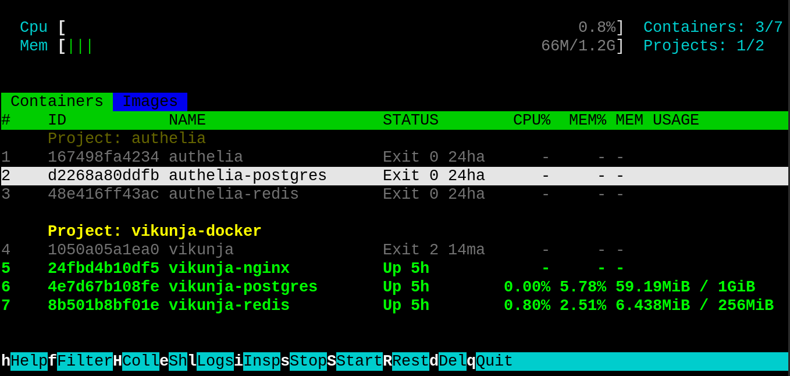

# dove

htop-like TUI for Docker containers, grouped by compose project. Shows real-time CPU, memory, network, block I/O, PIDs, and status with color coding. Supports filtering, scrolling, and container/project-level actions.



## Features

- **Grouped by compose project** — containers organized under their project headers
- **Real-time stats** — CPU%, MEM%, memory usage/limit, NET I/O, BLOCK I/O, PIDs
- **Streaming stats** — single persistent `docker stats` connection, no polling overhead
- **Color coding** — green=running, red=stopping, yellow=starting/paused, dim=exited
- **Container actions** — stop, start, restart, pause, unpause, remove (all async, non-blocking)
- **Project actions** — act on entire compose project at once
- **Async operations** — docker commands run in background threads, UI stays responsive
- **Filtering** — filter by container name or project name
- **Line numbering** — all listings numbered from left edge
- **Collapse mode** — `H` to collapse/expand project containers
- **Keyboard navigation** — arrow keys, vim-style j/k, page up/down, home/end
- **Interactive views** — `e` to exec shell, `l` for logs, `i` for inspect

## Quick start

```bash
dove
```

On NixOS, the launcher automatically uses `nix-shell -p python3`. On other distros, it falls back to the system `python3`.

## Usage

### Navigation

| Key | Action |
|-----|--------|
| `↑`/`k` or `↓`/`j` | Move selection up/down |
| `PgUp`/`PgDn` or `Space` | Move selection one page |
| `g` / `G` | Jump to first/last item |

### Filtering

| Key | Action |
|-----|--------|
| `f` / `F` / `/` | Enter filter mode |
| `Enter` / `Esc` | Apply / cancel filter |
| `Backspace` | Delete last character |

### Container actions (on selected container row)

| Key | Action |
|-----|--------|
| `s` | Stop container |
| `S` | Start container |
| `R` | Restart container |
| `p` | Pause container |
| `P` | Unpause container |
| `d` | Force remove container |

### Project actions (on selected project header)

| Key | Action |
|-----|--------|
| `s` | `docker compose -p PROJECT stop` |
| `S` | `docker compose -p PROJECT start` |
| `R` | `docker compose -p PROJECT restart` |
| `d` | `docker compose -p PROJECT down` |

All actions prompt with confirmation before executing and run in background threads — the UI never blocks.

### Other

| Key | Action |
|-----|--------|
| `r` | Force refresh |
| `q` / `:q` | Quit |
| `h` / `H` / `?` | Help |

## Requirements

- Docker (with `docker ps`, `docker stats`, `docker compose` support)
- Python 3.x with `curses` module (stdlib)
- On NixOS: `nix-shell` (autodetected)
- On other distros: `python3` in PATH

## Files

| File | Purpose |
|------|---------|
| `dove` | Standalone bash+Python script (single file, no deps) |

## License

MIT
